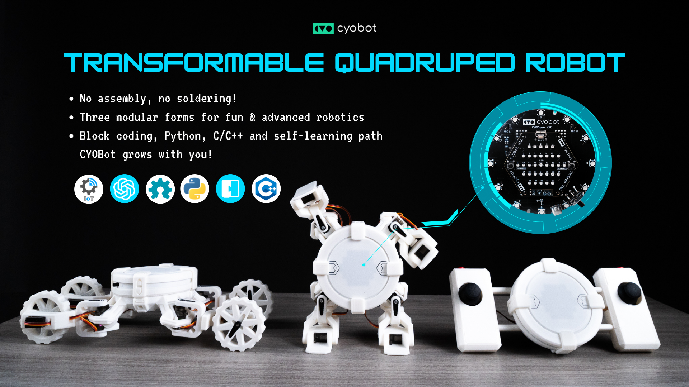
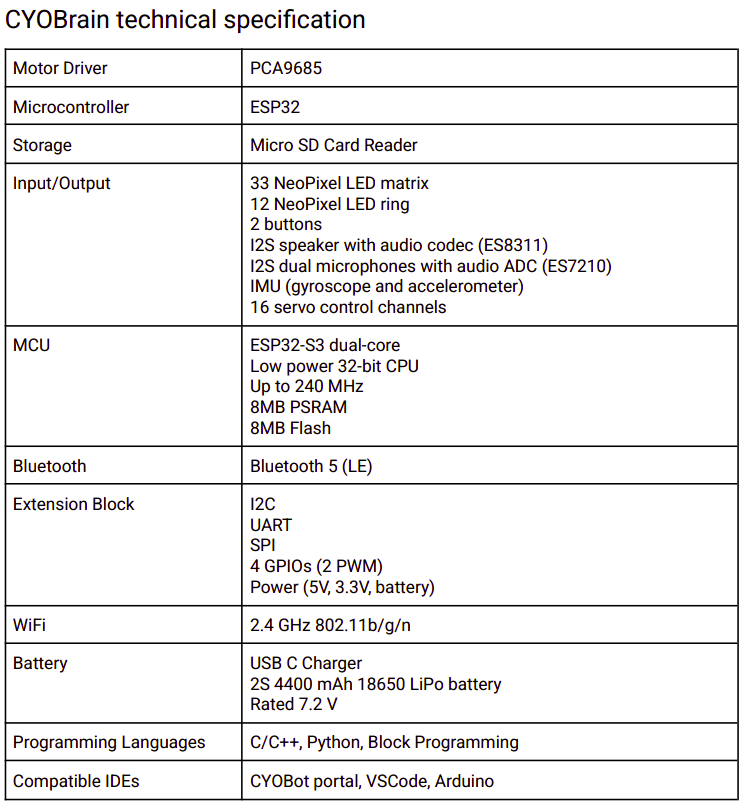
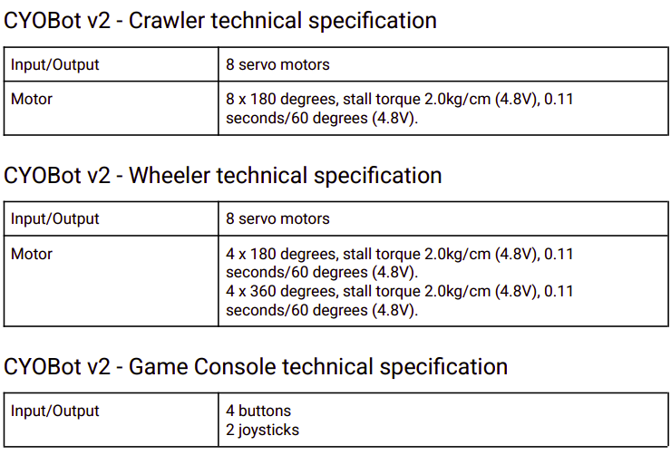
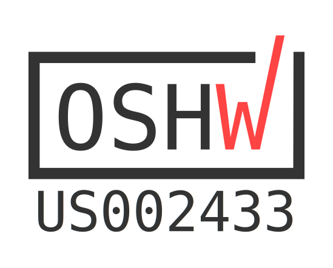
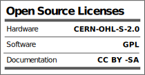

# Introduction
This is the official repository of CYOBOT LLC **CYOBot v2, a transformable quadruped robot**. See our story on [Kickstarter](https://www.kickstarter.com/projects/cyobot/cyobot-a-transformable-quadruped-robot-for-innovation-and-fun) and [Hackaday](https://hackaday.io/project/199084-cyobot-v2-transformable-quadruped-robot).

The second version of CYOCrawler open-source quadruped robot ([GitHub](https://github.com/CYOBot/CYOCrawler), [Hackaday](https://hackaday.io/project/193061-cyocrawler-open-source-quadrupedal-robot)). CYOBot v2 is an open-source modular plug-and-play robotic platform suitable for makers, students, and researchers, with more hardware and software upgrades, allowing complex application development like reinforcement learning, voice-enabled chatbot (ChatGPT integration), real-time motion planning, cloud and edge computing, etc.

The microcontroller is upgraded to ESP32-S3 with 8MB of PSRAM, allowing better memory-exhaustive applications like audio processing, machine learning, and real-time applications. Especially, using the built-in coding interface via WiFi will not cause Memory Allocation Error problem again. Upgrading to ESP32-S3 also means more GPIOs to spare, and connecting external peripherals like a camera module is now possible.

We also took inspiration from ESP32-S3-Korvo-2 V3.0 to design the PCB's audio module, with dedicated audio CODEC for I2S speaker and stereo microphone, allowing users to interact with robots using voice commands, and even connect to ChatGPT for prompt responses.

The 3D printing parts are improved and extended to different robotic designs: wheels (Ackermann and leg-wheel hybrid), quadruped, humanoid, and game console. To seamlessly switch between designs, we decouple the electronics, such that design-dependent electronics are grouped into a separate PCB and placed within the mechanical frame of each design, called mechanical board.

# Instruction
The `hardware/mechanical/STLs` directory includes the STL files for 3D printing designs of all robot bases and brain. Assembly instruction can be found here:
* For Crawler: [Instruction with Python](https://youtu.be/2CuqHpGuNUw), [Instruction with Block](https://youtu.be/lpqW0EeU5Hk)
* For Wheeler: [Instruction with Python](https://youtu.be/wRgvuCD4Dzg), [Instruction with Block](https://youtu.be/jAzg2xmtxaY)
* For Console: [Instruction](https://youtu.be/jlgunPV41hM)

# Technical Specification
The following is the technical specification of the new CYOBot v2 brain design:

Accompanying the new brain design are 3 robot bases, with the following technical specifications:

# License
This product is open-source certified by OSHWA ([US002433](https://certification.oshwa.org/us002433.html)).

 

# Community
Follow us on social media and join the community!

&nbsp;&nbsp;
&nbsp;&nbsp;
&nbsp;&nbsp;